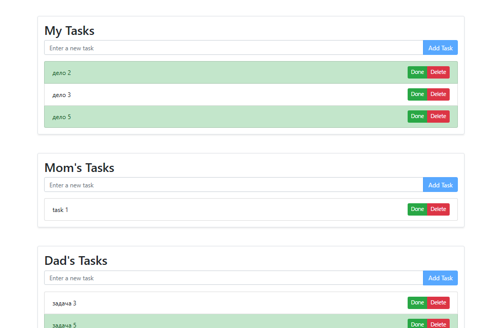

# To-Do App

> ⚠️ **Note:** On GitHub Pages, the app works only in offline mode (localStorage). To use all features (including API and multi-user support), please clone the repository and run the server locally. See instructions in the "How to Run the Project" section.

A simple modular to-do list application using JavaScript, HTML, and Bootstrap. Supports both offline (localStorage) and online (REST API) modes, multi-user lists, and multilingual interface.

## Demo

You can try the app online (offline mode only) via [GitHub Pages](https://kate8382.github.io/to-do_app/).

## Features

- Add, complete, and delete tasks
- Data is stored both in localStorage (offline) and on a backend server (API)
- Automatic synchronization between API and localStorage
- Multilingual interface (Russian/English)
- Modular code structure (UI, API, translations)
- Hash-based navigation between user lists (SPA-like)
- Separate page for viewing all users' lists (for developers/testing)

## Project Structure

- **docs/index.html**: Main page for user lists (My, Mom's, Dad's) with hash navigation
- **docs/all.html**: Developer/testing page for viewing all lists at once
- **docs/js/view.js**: UI rendering, user interaction, language switching
- **docs/js/api.js**: API and localStorage logic
- **docs/js/i18n.js**: Translations and supported languages
- **todo-server/**: Simple backend server and data storage
- **README.md**: Project documentation

## How to Run the Project

1. Clone the repository:
   ```bash
   git clone https://github.com/kate8382/to-do_app
   ```
2. Start the server (if required):
   ```powershell
   cd to-do_app/todo-server
   # Node.js required (recommended version: 14+)
   node index.js
   ```
3. Open the `index.html` file in your browser (from the `docs` folder for GitHub Pages compatibility).

## Pages and Navigation

- **index.html** — main user page. Switch between lists (My, Mom's, Dad's) via hash routing (`#my`, `#mom`, `#dad`) without page reloads.
- **all.html** — view all to-do lists at once (for developers/testing). Can be hidden from users by removing the menu link.

## Hash Routing (SPA-like Navigation)

Navigation between lists is implemented by changing the hash in the address bar. This allows dynamic loading of the required list without reloading the page.

## Multilanguage Support

The interface supports both Russian and English. Language switching works on all pages, including all.html.

## For Developers

The all.html page is intended for developers and testers. It allows you to see all to-do lists at once and can be hidden from regular users (for example, by removing the link from the menu).

## Screenshots

Below you can see both the user interface and the developer tools (showing localStorage and API usage):




## Example Navigation

- `index.html#my` — My Tasks
- `index.html#mom` — Mom's Tasks
- `index.html#dad` — Dad's Tasks
- `all.html` — All to-do lists (for developers)

## License

This project is licensed under the [MIT License](LICENSE).
