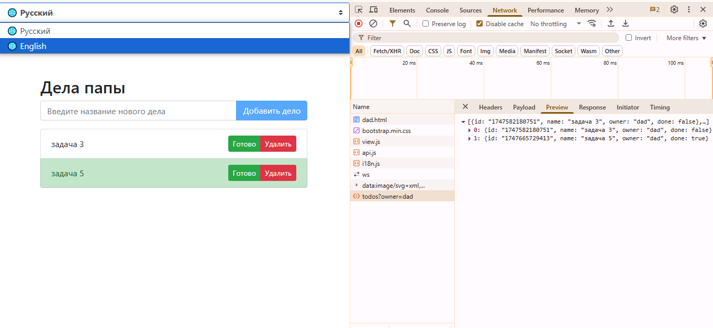
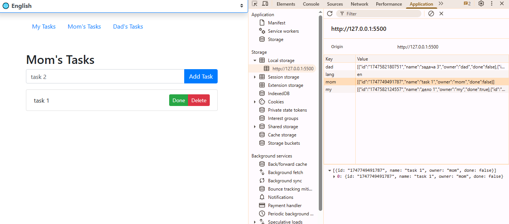

# To-Do App

A simple application for creating a to-do list using JavaScript, HTML, and Bootstrap.

## Description

This application allows users to:
- Create tasks.
- Mark tasks as completed.
- Delete tasks.
- Save tasks in `localStorage` so they persist between sessions.

## Project Structure

- **index.html**: The main page of the application.
- **todo-app.js**: The core logic of the application.
- **README.md**: Project documentation.

## Technologies Used

- **HTML**: For the structure of the page.
- **CSS (Bootstrap)**: For styling the interface.
- **JavaScript**: For implementing functionality.
- **localStorage**: For saving data on the client side.

## How to Run the Project

1. Clone the repository:
   ```bash
   git clone https://github.com/kate8382/to-do_app

2. Open the index.html file in your browser.

## Features

1. Adding tasks:

- Enter the task name in the input field.
- Click the "Add Task" button.

2. Marking tasks as completed:

- Click the "Done" button next to a task to mark it as completed.

3. Deleting tasks:

- Click the "Delete" button next to a task to remove it.

4. Saving data:

- All tasks are saved in localStorage and automatically loaded when the page is reopened.

## Navigation

The application supports multiple to-do lists:

* **My Tasks**
* **Mom's Tasks**
* **Dad's Tasks**

You can switch between lists using the navigation menu.

## Screenshots





## License

This project is licensed under the [MIT License](LICENSE).
