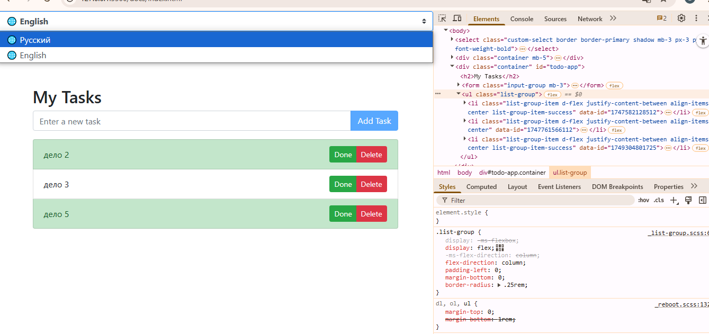

# To-Do App

> ⚠️ **Note:** On GitHub Pages, the app works only in offline mode (localStorage).
> To use all features (including API and multi-user support), please clone the repository and run the server locally.
> See instructions in the "How to Run the Project" section.

A simple application for creating a to-do list using JavaScript, HTML, and Bootstrap.

## Demo

You can try the app online (offline mode only) via [GitHub Pages](https://kate8382.github.io/to-do_app/docs/index.html).

## Description

This application allows users to:
- Create tasks.
- Mark tasks as completed.
- Delete tasks.
- Work with tasks stored both on a backend server (API) and in `localStorage` (offline mode).
- Automatically synchronize tasks between API and localStorage.
- Switch between Russian and English interface (language selector in the UI).
- Use a modular code structure (separate files for view, API, translations).

## Project Structure

- **index.html, mom.html, dad.html**: Main pages for different to-do lists (My, Mom's, Dad's).
- **js/view.js**: Module responsible for rendering the UI, handling user interactions, and language switching.
- **js/api.js**: Module for working with the backend API and localStorage (hybrid logic).
- **js/i18n.js**: Module with translations and supported languages (for i18n).
- **js/todo-app.js**: (Optional) Combined logic for demonstration or legacy purposes.
- **README.md**: Project documentation.

## Technologies Used

- **HTML**: For the structure of the page.
- **CSS (Bootstrap)**: For styling the interface.
- **JavaScript (ES6 modules)**: For implementing functionality and modularity.
- **localStorage**: For saving data on the client side (offline support).
- **REST API**: For persistent storage and multi-user support.
- **i18n (Internationalization)**: For supporting multiple languages (RU/EN).

## How to Run the Project

1. Clone the repository:
   ```bash
   git clone https://github.com/kate8382/to-do_app
   ```
2. Start the server (if required):
   ```powershell
   cd to-do_app/todo-server
   node index.js
   ```
3. Open the `index.html` file in your browser (from the `docs` folder for GitHub Pages compatibility).

## Features

1. **Adding tasks:**
   - Enter the task name in the input field.
   - Click the "Add Task" button.

2. **Marking tasks as completed:**
   - Click the "Done" button next to a task to mark it as completed or uncompleted.

3. **Deleting tasks:**
   - Click the "Delete" button next to a task to remove it.

4. **Saving and synchronizing data:**
   - All tasks are saved both in localStorage and on the server (API).
   - If the server is unavailable, the app works in offline mode using localStorage.
   - When the server becomes available again, data is synchronized automatically.

5. **Language switching:**
   - The interface supports both Russian and English.
   - You can switch the language at any time using the dropdown at the top of the page.
   - All UI elements (navigation, buttons, placeholders, confirmations) are translated instantly.

6. **Modular code structure:**
   - The code is split into logical modules: UI (view.js), API (api.js), translations (i18n.js).
   - Easy to maintain and extend.

## Navigation

The application supports multiple to-do lists:

* **My Tasks**
* **Mom's Tasks**
* **Dad's Tasks**

You can switch between lists using the navigation menu. Each list is stored and synchronized separately.

## Screenshots

Below you can see both the user interface and the developer tools (showing localStorage and API usage):




## License

This project is licensed under the [MIT License](LICENSE).
